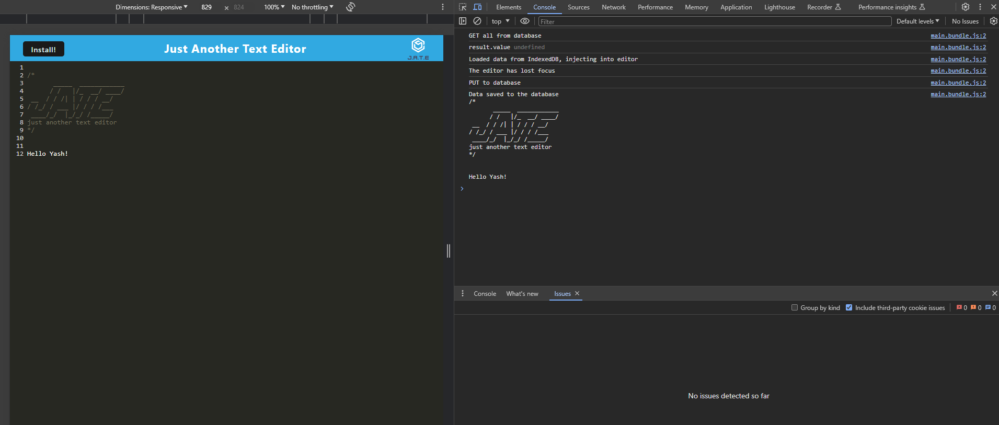

# Yash's Progressive Web Application: Text Editor

## Made by Jate, let's Edit some text!

Table of Contents
  
  * [Description](#description)
  * [Installation](#installation)
  * [How to use](#usage)
  * [License](#licenseSection)
  * [Github](#gitHub)
  * [Youtube Demo](#youtube)
  * [Contact](#Contact!)

### Description   
Jate Text Editor, an innovative browser-based tool, was developed with the primary goal of exploring and implementing Progressive Web App (PWA) principles. It incorporates various data persistence methods to ensure reliability, even if certain options are not supported by the browser, and boasts offline functionality. This addresses the need to create and access notes or code snippets regardless of internet connectivity, ensuring they can be reliably retrieved later.

Throughout the development of Jate Text Editor, several key insights were gained. These include understanding the lifecycle of service workers – from registration to activation – to effectively precache or cache resources. Additionally, the impact of webpacks on performance and load times was observed, particularly when bundling JavaScript applications and accommodating various assets like images, fonts, and style sheets. Finally, the implementation of installability enables users to conveniently access the application from their desktop or mobile device home screen.

### Installation

To install dependencies, navigate to the main directory in your terminal and run "npm i". This command automatically installs dependencies in both the client and server folders due to the start script defined in the root package.json. Next, execute "npm run build" to install webpack and generate the dist folder, which includes the manifest.json file for the browser. Finally, connect to the server by running "npm run start".

### How to use  

* To initiate this application from the terminal, execute "npm run start" to launch the server. Upon running, you'll see the message "Now listening at http://localhost:3000!" in the console. Simply (ctrl + click) on the link to access the application via the URL. 

* Click the "Install" button to download the web application as an icon on the desktop and taskbar. Launch the "JATE" application from the desktop or taskbar to load it with a registered Service worker and pre-cached static assets, ensuring swift loading of subsequent pages and assets.

  
#### Project License: MIT  
https://opensource.org/licenses/MIT

### Github 

https://github.com/yoboyyash/Yash-ORM-E-Commerce-BACKEND  
   
### Youtube 
Youtube demo for this project: 

https://youtube.com

# Contact me!  

Yash Baviskar: yashrajbaviskar@gmail.com